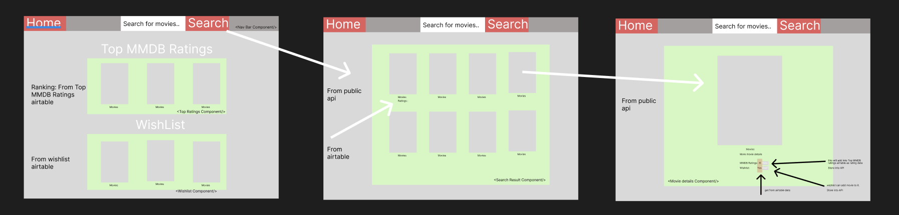
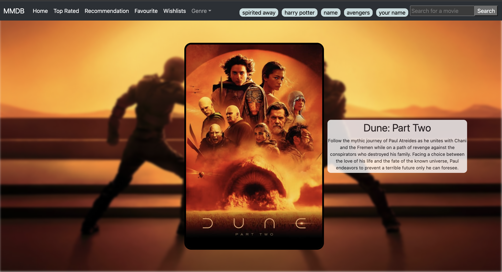

# MMDB [My Movie Database]

## Description

This movie database app, can help you locate where you can watch the movie, where you can look for their preferable movies check for any trailer of platform depending on their region and rate your own movie !

Any movies they search for will return a list of result. By clicking any movie poster , this will bring you into the detail movie page, where you can rate the movie, favourite movie or check for provider for the movie they wanted. Also based on your movie that you favourite, there’s a recommend list that will change based on the movie you like. So you can also browse them if you feel like check the platform to watch.

## Technology Used

- React
- HTML
- CSS
- Bootstrap for react
- Javascript
- Bruno
- Github
- Trello
- Airtable
- API used : TMDB

### Deployment

Here is the link to the app  ➡️  [MMDB](https://vercel.com/zeans-projects/mmdb)

## The Movie App

I use figma sketch out rough idea what the movie app might like, and this serve as my initial idea.

So, after a week into the developement for the app, the final looks of the app looks like this.

## The Process

There's a lot to needs to be done within a week. So to start simple, I used Trello board to kick start the development process, here is the list of processes.

- Started by testing out the possible API that I will be using for this project, and track them by using Bruno.
- After that, I also test out by performing CREATE, UPDATE and PATCH to airtable as that will eventually be used in my code later.
- Set up react-router to list out all the possible pages I wish to show.
- Create components like "Home", "Top Rated", "Search box" etc as each of the components has its specific function.
- Code all individual components and test out their functionality.
- Separate out some of the fetch services as individual js files to tidy up.
- Clean up codes and remove any unnecessary comments.
- Finally, touch up the readme.

## API used

- [TMDB](https://www.themoviedb.org/documentation/api)
- [Airtable](https://airtable.com/)

### Future Development

- Add a notification in the wishlist if provider is available in the future.
- Add a clickable link that can direct user to provider.

### Summary

Developing everything from scratch can be challenging, but throughout this project, I've learned the importance of simplicity and building small functions that serve specific purposes. As when developing throught the project, the function can get more and more complex. So keeping things straightforward and focusing on creating small, unique functionalities has been key to the project's success. By breaking down tasks into small components, we can ensure a smoother development process.
